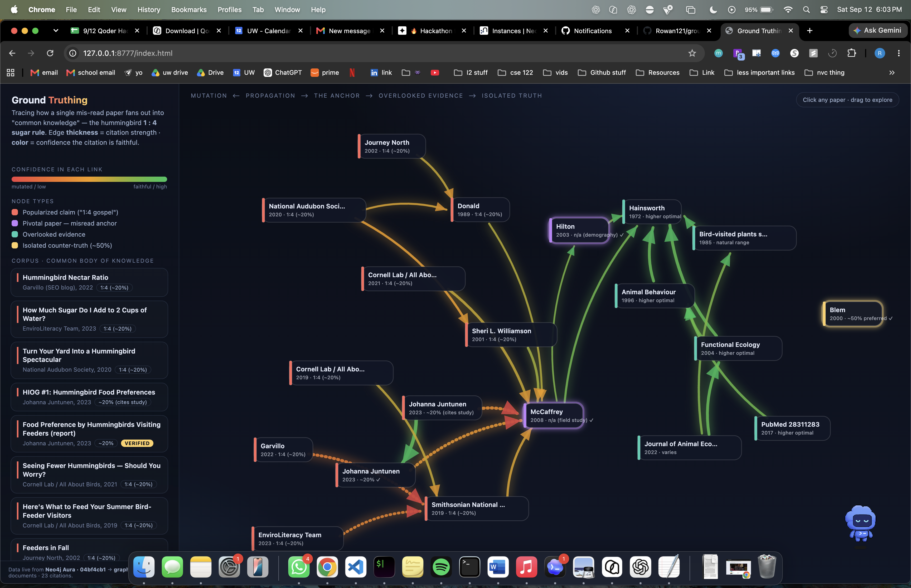

# Ground Truthing

Tracing how a single mis-read paper fans out into "common knowledge." The
case study is the hummingbird **1 : 4 sugar rule** (~20% sugar water): a
recommendation that became gospel across blogs, guides, and retailers even
though the papers it's attributed to never prescribed it — while an
overlooked study (Blem et al., 2000) found birds actually prefer a much
higher (~50%) sucrose concentration.



In the graph: edge **thickness** = citation strength, edge **color** =
confidence the citation is faithful (red = mutated claim, green = faithful).
The mis-read anchor sits in the middle, the popularized "1:4" claims fan out
on the left, overlooked correct evidence clusters on the right, and Blem 2000
stands alone as the isolated counter-truth.

## Repository layout

```
frontend/   D3 force-graph visualization (index.html) + graph.json data
backend/    Snapshot of the Neo4j GraphRAG knowledge graph + rebuild scripts
docs/        Screenshot
```

## View the visualization locally

The page fetches `graph.json`, so it needs a local web server — opening the
file directly (`file://`) will not work.

```
cd frontend
python3 -m http.server 8777
```

Then open <http://127.0.0.1:8777> in your browser. Anyone who clones this repo
can do the same; no deployment required. To share a public link instead,
enable GitHub Pages on the repo.

## Backend (Neo4j GraphRAG graph)

`backend/data/` is a snapshot of the knowledge graph that document-intelligence
ingestion built in Neo4j Aura from the source PDFs: **80 documents**,
**840 extracted claims** (with numeric `ratio_value` / `ratio_min` /
`ratio_max` fields), **25 text chunks**, and **3 source PDFs**. Chunk vector
embeddings are excluded (large and regenerable).

Rebuild it into your own Neo4j instance:

```
pip install -r backend/requirements.txt
export NEO4J_URI="neo4j+s://<instance>.databases.neo4j.io"
export NEO4J_USER="neo4j"
export NEO4J_PASSWORD="<your-password>"
python3 backend/import_backend.py
```

Re-dump a live instance back to `backend/data/` with
`python3 backend/export_backend.py` (same environment variables).

No credentials are stored in this repo; the scripts read them from the
environment.
